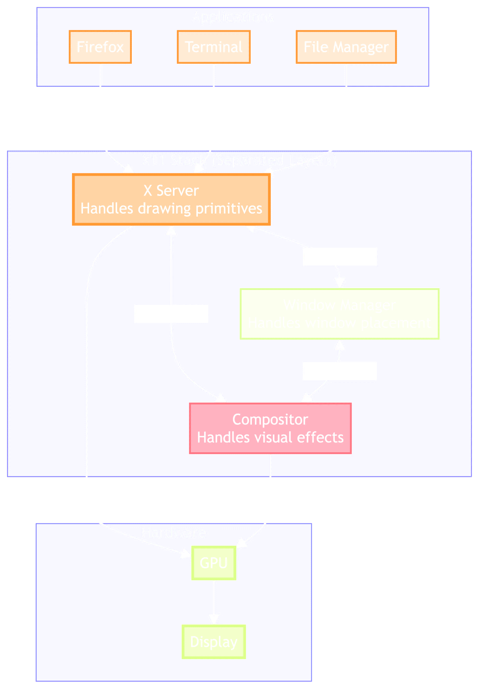
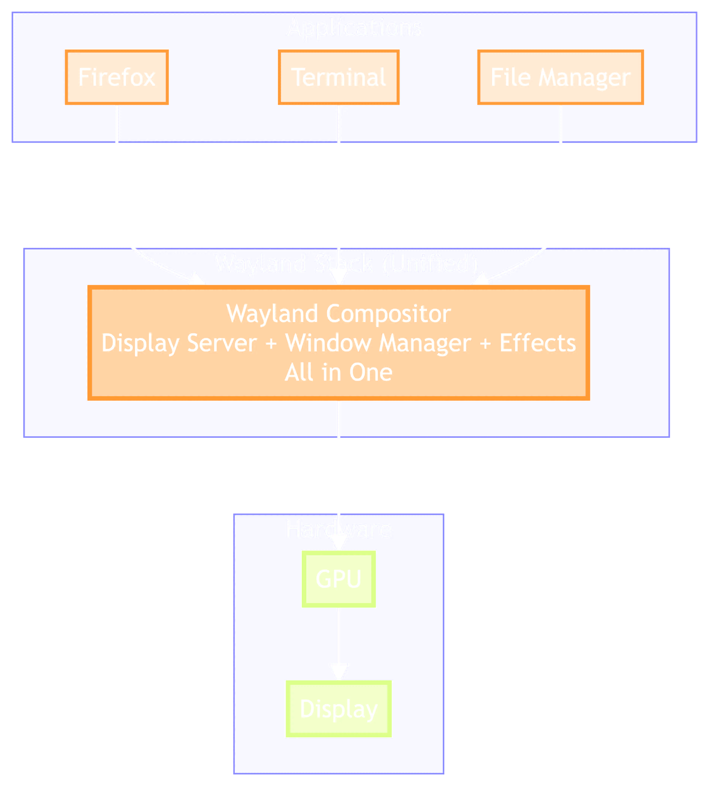

<!-- jump_to_middle -->
A tiling window manager (often) makes for a more efficient desktop.
===
<!-- alignment: center -->
<!-- pause -->
It's the keyboard-centric experience of terminal-based programs (vim, tmux) expanded to the graphical desktop.

---
<!-- column_layout: [1,1] -->
<!-- column: 1 -->
<!-- alignment: right -->

`apetbrz.dev/r/x-vs-wayland`
<!-- column: 0 -->
<!-- alignment: center -->
A Quick Review
===
<!-- new_lines: 2 -->
<!-- alignment: left -->
# Desktop Environment

A collection of programs that provide a unified GUI experience.
<!-- pause -->
# Display Server

The interface system between graphical programs (clients) and system input/output.

---
<!-- column_layout: [1,1] -->
<!-- column: 1 -->
<!-- alignment: right -->

`apetbrz.dev/r/x-vs-wayland`
<!-- column: 0 -->
<!-- alignment: center -->
A Quick Review
===
<!-- alignment: left -->
<!-- new_lines: 2 -->
# Window Manager

A program that handles positioning and decoration of the windows on a display server.
<!-- pause -->
# Compositor

A program that collects all windows' graphics and decides how to render them as one image.

---
<!-- column_layout: [1,1] -->
<!-- column: 1 -->
<!-- alignment: right -->
<!-- new_lines: 4 -->

`apetbrz.dev/r/x-vs-wayland`
<!-- column: 0 -->
<!-- alignment: center -->
A Quick Tangent
===
<!-- new_lines: 4 -->
# You probably have little reason not to switch to Wayland.
<!-- pause -->
<!-- alignment: left -->
`sway` is `i3` on Wayland.
<!-- pause -->
A "compositor" is the whole thing here.

---
<!-- column_layout: [1,2] -->
<!-- alignment: right -->
<!-- column: 0 -->
<!-- alignment: right -->
A Quick Review
===
<!-- alignment: left -->

# Display Manager

A program that handles connecting user login sessions to display server sessions.
<!-- column: 1 -->
```bash +exec
cat /usr/share/xsessions/i3.desktop
```
---
<!-- new_lines: 5 -->
i3
===
<!-- alignment: center -->
`https://i3wm.org/`
- Based off of `wmii`, a continuation of `wmi`.
- Built to be well-documented, simple, and fast.
- Aimed at power users, but simple enough to start with.
<!-- new_line -->
- Install with the `i3` package, with recommended software.
- Select the `i3` session when logging in.

---
Features
===

# Tiling
Windows split up available space, following a tree hierarchy.
<!-- pause -->
# Program launching
Using programs like `dmenu` or `rofi`.
<!-- pause -->
# Lightweight, per-monitor workspaces
<!-- pause -->
# Flexibility
Everything is bindable/rebindable and scripting is encouraged.
<!-- pause -->
# Useful mouse movements
<!-- pause -->
# Scratchpad windows

---
Configuration
===
<!-- new_lines: 5 -->
<!-- alignment: center -->
`~/.config/i3/config`

`https://i3wm.org/docs/userguide.html`

---
Modularity on the Desktop
===
<!-- new_lines: 3 -->
<!-- alignment: center -->
__Switching your WM doesn't mean throwing away the desktop as you know it.__

- Desktop suites consist of many standalone programs.
- Display managers let you choose your session upon login.

<!-- pause -->
<!-- alignment: center -->
<!-- new_line -->
__Some desktop environments outright let you replace their built-in WM.__

`KDE` (on X11), `MATE`, `Xfce`, `LXQt`
<!-- pause -->
<!-- new_line -->
_...it may just be a little janky..._

---
Modularity on the Desktop
===

<!-- alignment: left -->
## Launchers:
`dmenu`, `rofi`, `krunner` (KDE), `wmenu`
## Bars:
`i3bar` (`i3status`), `polybar`, `xfce4-panel` (Xfce), `lxqt-panel` (LXQt), `waybar`
## File Browsers:
`Dolphin` (KDE), `Cosmic Files` (COSMIC), `Thunar` (Xfce)
## System Monitors:
`Resources` (GNOME), `Plasma System Monitor` (KDE), `Task Manager` (Xfce)

---
Other Tiling WMs
===
<!-- new_lines: 4 -->
<!-- column_layout: [1,1] -->
<!-- column: 0 -->
# dwm
__Super__ minimal window manager, from the devs of `wmii`.
<!-- column: 1 -->
<!-- alignment: right -->
`https://dwm.suckless.org/`
<!-- alignment: left -->

<!-- column_layout: [1,1] -->
<!-- column: 0 -->
# awesome
Supports extensions, fancier decorations.
<!-- column: 1 -->
<!-- alignment: right -->
`https://awesomewm.org/`
<!-- alignment: left -->

---
On Wayland, too!
===
<!-- column_layout: [1,1] -->
<!-- column: 0 -->
# sway
It's effectively a port of `i3`.
<!-- column: 1 -->
<!-- alignment: right -->
`https://swaywm.org/`
<!-- alignment: left -->

<!-- column_layout: [1,1] -->
<!-- column: 0 -->
# Hyprland
"Modern" with lots of eye candy.
<!-- column: 1 -->
<!-- alignment: right -->
`https://hypr.land/`
<!-- alignment: left -->

<!-- column_layout: [1,1] -->
<!-- column: 0 -->
# Niri
Infinitely scrolling.
<!-- column: 1 -->
<!-- alignment: right -->
`https://niri-wm.github.io/`
<!-- alignment: left -->

<!-- column_layout: [1,1] -->
<!-- column: 0 -->
# MangoWC
Workflow-focused.
<!-- column: 1 -->
<!-- alignment: right -->
`https://mangowm.github.io/`
<!-- alignment: left -->
<!-- reset_layout -->
---
<!-- jump_to_middle -->
<!-- alignment: center -->
End
===
<!-- no_footer -->
